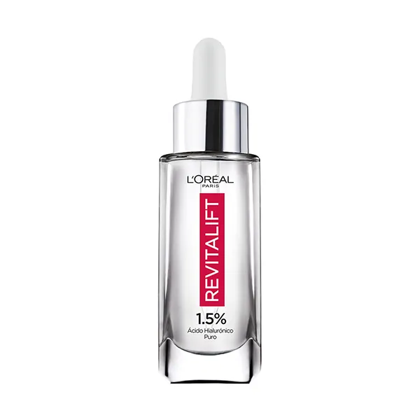

Proyecto Well Age

Descripción:

Well Age es una plataforma web diseñada para ofrecer productos de cuidado personal que acompañan a los usuarios en su camino hacia una piel saludable y radiante en cada etapa de la vida. El sitio cuenta con una interfaz intuitiva para explorar productos y agregar al carrito de compras. Además, proporciona una sección de contacto para consultas.

Estructura del Proyecto:
index.html:

Página de inicio que presenta la misión de Well Age, destacando el bienestar y la salud de la piel en diferentes etapas.
Enlaces a las secciones de productos y contacto.

productos.html:

Página dedicada al catálogo de productos donde los usuarios pueden ver detalles de cada artículo (nombre, imagen y precio).

Opción de agregar productos al carrito de compras.
Estilos y Diseño:
La apariencia del sitio está gestionada por archivos CSS  que definen la estructura, colores, tipografía y disposición de los elementos.

Interactividad:

Uso de JavaScript  para manejar la funcionalidad de agregar productos al carrito, simular el proceso de compra y gestionar la visualización de los productos en la página.
Carrito de Compras:

Los productos seleccionados se almacenan en el carrito mediante el uso de almacenamiento local (localStorage), lo que permite a los usuarios revisar su selección antes de proceder al pago.
Contactos:

Sección de contacto para consultas adicionales y atención al cliente.
Tecnologías Utilizadas:
HTML5
CSS3
JavaScript (Vanilla)
localStorage para la persistencia del carrito de compras.
# proyecto.final
